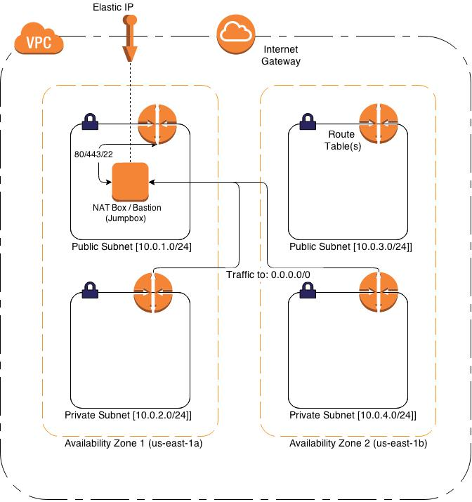

#Architecture Design Document

----------

## Abstract:
This architecture design document provides solutions for a scalable, elastic, redundant, high performance, secure, fault tolerant and recoverable architecture that enables organic growth.
## Design: 

####VPC Infrastructure:
 

 

### Key Tenets of the design:

#### VPC:
Amazon *Virtual Private Cloud (VPC)* enables private, isolated section of the cloud defined by a CIDR block. The VPC design is associated with a default route table that defines a range of valid IP addresses within the virtual network as highlighted in the VPC infrastructure design diagram. 

Amazon EC2 instances that customers use to process, store, or transmit PHI are run on Dedicated Instances, which are instances that run in an Amazon VPC on hardware dedicated to a single customer. 

#### Cloudformation Configuration:

##### VPC
The VPC is associated with a default route table that defines a range of valid IP addresses within the virtual network.  VPC's route table is set to a of range 10.0.0.0/16. Depending on your environment (Dev/QA/Production) you would use a separate CIDR block. 

##### Subnet
A subnet defines a range of IP addresses within a VPC.

* Public subnets:
  * Available IPs: 10.0.1.0/24 and 10.0.3.0/24
  * Route table
    * 10.0.0.0/16 -> local, all outgoing traffic (10.0.0.0 to 10.255.255.255) are directed to only within the local network
    * 0.0.0.0/16 -> internet gateway, all other outgoing traffic are routed to the internet via the internet gateway

* Private subnets:
  * Available IPs: 10.0.2.0/24 and 10.0.4.0/24
  * Route table:
    * 10.0.0.0/16 -> local, same as above.
    * 0.0.0.0/0 -> NAT instance id, all other outgoing traffic are routed to the NAT instance

##### Security Groups
A security group controls inbound/outbound traffic at the instance level.
(outgoing traffic do not have restrictions unless noted below):

##### WebServer
* Inbound - accepts traffic to ports 80, 443, and 8080.

##### Public SSH
* Inbound - all TCP traffic to port 22.

##### Private SSH
* Inbound
  * TCP traffic to port 22 for only local traffic (10.0.0.0/16)
  * all traffic for ports 80, 443, and 8080.
  
##### NAT
* Inbound
  * all local TCP traffic (10.0.0.0/16) for ports 22, 25, 80, 443.
  * all local ICMP traffic (10.0.0.0/16) for all ports.
* Outbound
  * all TCP traffic to ports 80 and 443, all ICMP traffic to all ports.

##### Network ACLs
Network ACLs is an optional layer that controls inbound/outbound traffic at the subnet level.  I am using security groups instead as this is a subnet wide setting that will override any security group settings.

##### Route table
Route tables determines how traffic is directed for all instances within a subnet. Each subnet is associated with a route table.

##### NAT instance
The NAT instance resides within the public subnet and enables instances within the private subnet to connect to the internet.  All outgoing traffic for instances in the private subnet are routed to the NAT instance
